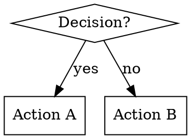

# Skill Conventions

Reference: `superpowers:writing-skills` (see `skills/writing-skills/SKILL.md` for full detail)

## File structure

```
skills/
  skill-name/
    SKILL.md              # Main reference (required)
    supporting-file.*     # Prompt templates, scripts, etc.
```

All skills in a flat namespace under `skills/`.

## Frontmatter (YAML)

```markdown
---
name: skill-name-in-kebab-case
description: Use when [specific triggering conditions and symptoms]
---
```

- `name`: letters, numbers, hyphens only — no special characters
- `description`: third-person, starts with "Use when...", describes ONLY triggering conditions (never workflow steps), max ~500 characters
- Total frontmatter max: 1024 characters

**Critical — description must NOT summarize the skill's workflow.** If the description says "dispatches subagents and reviews them", Claude will follow the description instead of reading the skill body. Keep descriptions to triggering conditions only.

## Writing style

- Skills are instructions to the agent: imperative second-person ("Dispatch the subagent", "Write the file")
- `##` for major sections, `###` for sub-sections
- Code blocks for exact commands, file contents, and formats
- Self-contained — the agent should not need to read other files to follow the skill

## Word count targets

- Frequently-loaded workflow skills: aim for <500 words in SKILL.md
- Supporting prompt templates: no strict limit, but be concise

## Flowcharts

Use `dot` (Graphviz) syntax for process flows. Use flowcharts only for non-obvious decision points and process loops — not for linear instructions or reference material. Node labels must have semantic meaning (not "step1", "helper2").



## Invocation

Skills are invoked via the `Skill` tool: `Skill("codebase-cleanup")`. The full qualified name is `superpowers:codebase-cleanup`. Skill name used in invocations is the `name` frontmatter field prefixed with `superpowers:`.
