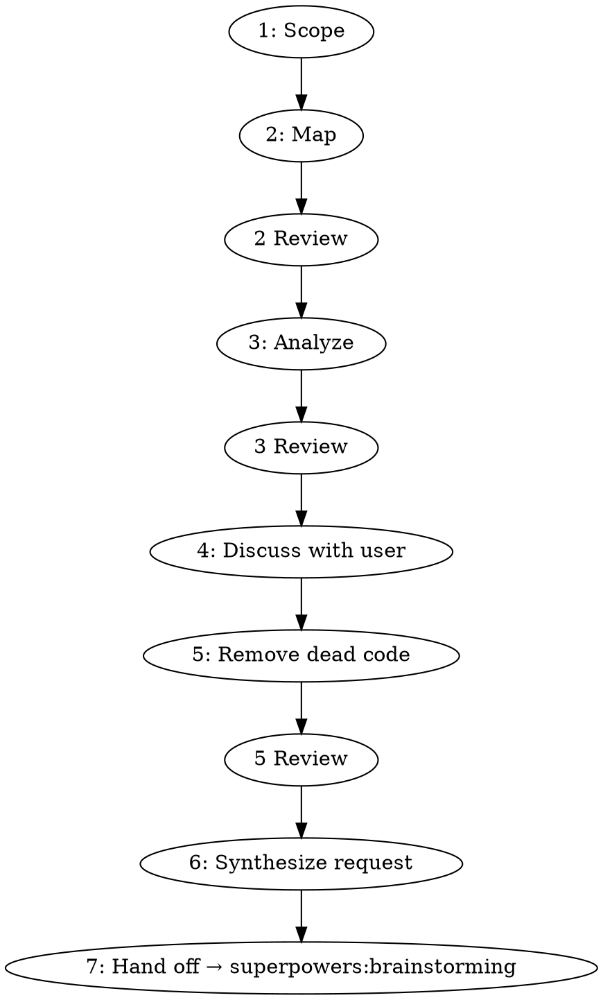

# Task 1: Create SKILL.md

**Files:**
- Create: `skills/codebase-cleanup/SKILL.md`

**Context:** `context/skill-conventions.md`

**Design spec:** `docs/superpowers/specs/2026-04-12-codebase-cleanup-design.md`

---

- [ ] **Step 1: Create the skill directory and SKILL.md**

Create `skills/codebase-cleanup/SKILL.md` with this exact content:

````markdown
---
name: codebase-cleanup
description: Use when the user wants to clean up, reorganize, deduplicate, or remove dead code from a codebase or part of one
---

# Codebase Cleanup

Orchestrates a 7-step pipeline: scope → map → analyze → discuss → remove → synthesize → hand off to `superpowers:brainstorming`. The orchestrator (you) coordinates all subagents and is the only entity that speaks to the user.

## Pipeline



## Step 1: Scope

Always ask the user what to clean up first. Two paths:

- **Directory path:** Treat as primary scope and proceed to the forgotten-code check.
- **Semantic description:** Dispatch parallel exploration subagents (grep, symbol search, cross-reference tracing) to find all relevant files. Present findings to user for confirmation.

**Forgotten-code check (always, both paths):** Dispatch parallel search subagents using keywords, symbol names, and synonyms derived from the scope to look for related code in OTHER directories. Present: *"Found potentially related code outside your scope — include?"* User confirms the final confirmed file set.

## Step 2: Map

Set session timestamp as `YYYY-MM-DD-HHmm`. All output: `docs/superpowers/code-map/<timestamp>/`.

- **MAP:** Dispatch one `./directory-mapper-prompt.md` subagent per confirmed directory (parallel). Each writes `by-directory/<dir>.md`.
- **REDUCE:** Dispatch `./map-consolidator-prompt.md`. Reads all `by-directory/` files. Writes `by-group/<group>.md` files and `index.md`.
- **REVIEW:** Dispatch `./map-reviewer-prompt.md`.

## Step 3: Analyze

Dispatch one `./analysis-prompt.md` subagent per group file (parallel). Each appends `## Analysis` to its file. Then dispatch `./analysis-reviewer-prompt.md`.

## Step 4: Discuss

You (orchestrator) present consolidated findings from all `## Analysis` sections to the user. Confirm which dead code and obsolete tests to delete. Do not delegate this step to a subagent.

## Step 5: Remove

Dispatch `./deletion-agent-prompt.md` with the confirmed deletion list. Then dispatch `./deletion-reviewer-prompt.md`.

## Step 6: Synthesize

Dispatch `./refactoring-request-prompt.md`. Produces `docs/superpowers/code-map/<timestamp>/refactoring-request.md`.

## Step 7: Hand Off

Invoke `superpowers:brainstorming` with the refactoring request document as context.

## Code Map File Formats

**`by-directory/<dir>.md`:**
```
# <directory>
## Exports / Public API
- `symbol(args): ReturnType` — one sentence
## Internal symbols (not exported)
- `symbol(args)` — one sentence
## Semantic group suggestion
<group name>
## Dead / obsolete tests
- `test.ts` — evidence (or "(none)")
```

**`by-group/<group>.md`:**
```
# <Group Name>
## Directories
## Full API surface
## Cross-directory dependencies
## Analysis        ← appended by Step 3 agents
### Dead code
### Duplicated logic
### Abstraction opportunities
```

**`index.md`:** Group list with one-line descriptions + directory-to-group mapping table.

## Prompt Templates

- `./directory-mapper-prompt.md` — maps one directory (MAP phase)
- `./map-consolidator-prompt.md` — consolidates directory maps into groups (REDUCE phase)
- `./analysis-prompt.md` — analyzes one semantic group
- `./deletion-agent-prompt.md` — removes confirmed dead code
- `./refactoring-request-prompt.md` — synthesizes final request document
- `./map-reviewer-prompt.md` — Step 2 review
- `./analysis-reviewer-prompt.md` — Step 3 review
- `./deletion-reviewer-prompt.md` — Step 5 review

## Key Constraints

- Consolidator is the only agent that reads across directory files
- Analysis agents read only their assigned group file
- Step 4 discussion: handle via AskUserQuestion directly — do not delegate to a subagent
- Dead code claims must include grep evidence; analysis-reviewer rejects unsubstantiated claims
- Forgotten-code check runs regardless of how scope was specified
````

- [ ] **Step 2: Verify frontmatter**

Check that:
- `name` is `codebase-cleanup` (kebab-case, no special characters)
- `description` starts with "Use when" and does not describe the workflow steps
- Combined frontmatter is under 1024 characters (count the `---` delimiters and all fields)

- [ ] **Step 3: Verify the file was created**

Run: `ls skills/codebase-cleanup/`

Expected output: `SKILL.md`
