# Living Documentation Skill Design

**Date:** 2026-05-11
**Status:** Draft
**Absorbs:** `doc-wishlist` skill

## Goal

Create a hybrid discipline-enforcing + technique skill that governs how agents author, maintain, and improve code documentation. The skill strictly enforces that redundant, overlapping, or stale documentation is worse than no documentation, while providing clear technique for choosing the right documentation form for each type of information.

## Core Principles

1. **Documentation expresses what code and types cannot.** If the code or type system already says it, don't say it again.
2. **No documentation is better than wrong documentation.** Wrong docs mislead. Stale docs are wrong docs.
3. **Redundant documentation is a liability.** Overlapping docs drift apart. Single source of truth.
4. **In-place documentation preferred** when it makes sense. Doc comments, jsdoc, rustdoc, etc. are closer to the code they describe.
5. **Bidirectional references.** Code references docs. Docs reference code. Unreferenced docs are stale docs.
6. **RFC2119 wording.** MUST, SHOULD, MAY for clarity.
7. **Prefer types for invariants.** Express invariants via the type system when possible. Document only what types can't capture.

## Skill Structure

**Name:** `documentation`
**File:** `skills/documentation/SKILL.md`
**Type:** Hybrid discipline-enforcing + technique

### Sections

1. **Overview** — Core principle (docs express what code cannot; redundant docs are liabilities)
2. **When to Use** — Trigger conditions
3. **The Iron Law** — Strict discipline rules with no-exceptions list
4. **What Belongs in Docs** — Table mapping information types to documentation forms
5. **Choosing Doc Form** — Decision flowchart
6. **Doc Constitution** — Project-specific conventions in `DOCS.md`
7. **Bidirectional Referencing** — How code and docs reference each other
8. **Maintenance** — Updating docs alongside code; inline desloppification
9. **When You Struggle** — Absorbed doc-wishlist trigger
10. **Diagrams** — Mermaid vs Graphviz guidance
11. **Rationalization Table** — Common excuses for bad docs
12. **Red Flags** — Stop signs
13. **Common Mistakes**

## Detailed Design

### Iron Law

```
No documentation is better than wrong documentation.
Wrong documentation is worse than no documentation.
Documentation that duplicates code is wrong documentation.
```

Strict: redundant, contradictory, or unverifiable documentation MUST be deleted or fixed immediately. No exceptions for "it might be useful later."

**No exceptions:**
- Don't keep outdated docs "for reference"
- Don't add docs that restate what code clearly expresses
- Don't leave TODO docs — either write the doc or don't create the file
- Don't document what the type system already enforces

### What Belongs in Docs

| Information Type | Where it belongs |
|---|---|
| What the code does | Code itself (names, types, structure) |
| Why a decision was made | Doc comment or ADR |
| Invariants not expressible in types | Doc comment near the invariant |
| How to use the module/API | Module-level doc comment |
| System architecture / data flow | Mermaid diagram in module doc |
| How to run/debug/deploy | Runbook |
| Acknowledged limitations/drawbacks | Doc comment |
| Temporal ordering constraints | Doc comment |
| Cross-cutting architectural decisions | ADR |

**Cross-reference:** Express invariants via types first (see `jj-superpowers:designing-with-types-and-abstractions`). Only document what types can't capture.

### Choosing Doc Form (Decision Flowchart)

```dot
digraph doc_form {
    rankdir=LR;
    info [label="Information needs documenting?" shape=diamond];
    types [label="Can it be expressed\nin types?" shape=diamond];
    encode [label="Encode in types.\nNo doc needed." shape=box style=filled fillcolor="#ccffcc"];
    local [label="Local to one\nfunction/module?" shape=diamond];
    inline [label="Inline doc comment" shape=box];
    xcut [label="Cross-cutting\narchitectural decision?" shape=diamond];
    adr [label="ADR" shape=box];
    ops [label="About running,\ndebugging, deploying?" shape=diamond];
    runbook [label="Runbook" shape=box];
    sys [label="System-level\noverview?" shape=diamond];
    mermaid [label="Module doc with\nMermaid diagram" shape=box];
    nodoc [label="Don't document it" shape=box style=filled fillcolor="#ffcccc"];

    info -> types;
    types -> encode [label="yes"];
    types -> local [label="no"];
    local -> inline [label="yes"];
    local -> xcut [label="no"];
    xcut -> adr [label="yes"];
    xcut -> ops [label="no"];
    ops -> runbook [label="yes"];
    ops -> sys [label="no"];
    sys -> mermaid [label="yes"];
    sys -> nodoc [label="no"];
}
```



### Doc Constitution: `DOCS.md`

Project-specific documentation conventions live in `DOCS.md` at the project root. In monorepos, each package can have its own `DOCS.md` that extends/overrides the root.

`DOCS.md` specifies:

```markdown
# Documentation Conventions

## Location
- Where docs live (e.g., `docs/` for architecture, `ADR/` for decisions)
- Where runbooks live (e.g., `docs/runbooks/`)

## Forms Used
- ADR format (e.g., "ADR/NNNN-title.md" with status/proposal/decision sections)
- Module READMEs (yes/no)
- Inline doc comments (language-specific conventions)

## Naming
- File naming conventions
- Diagram format preference (Mermaid for human-facing, Graphviz for specs)

## RFC2119
- Using MUST/SHOULD/MAY for normative language

## Monorepo (if applicable)
- Root `DOCS.md` provides defaults
- Package `DOCS.md` overrides for package-specific conventions
```

When starting work on a project, check for `DOCS.md` first. If absent, follow this skill's defaults.

### Bidirectional Referencing

Code and docs MUST reference each other:

- **Doc comments** link to architecture docs: `// See DOCS.md#auth-flow for the full picture`
- **Architecture docs** link to code: `Implemented in src/auth/session.ts`
- **ADRs** link to both the code implementing the decision and the docs discussing it
- **Module doc comments** reference the module file path they describe

Unreferenced docs are stale docs. If you can't find the code a doc references, the doc is suspect.

### Maintenance

When maintaining docs as part of code changes:

1. **Small safe desloppifications** — removing comment-duplication, adding type-encoded invariants, fixing stale cross-references — do inline as part of the change.
2. **Anything that could change functionality** — offer separately to the user. "I noticed X while documenting Y. Want me to fix that in a separate change?"
3. **Stale docs** — delete or update. Never leave stale docs.
4. **Overlapping docs** — merge into single source of truth. Remove the duplicate.

### When You Struggle (absorbed doc-wishlist)

Two paths:

1. **Propose it** — When you spent significant effort reading multiple files or tracing execution to understand something that a short doc could have explained, create a proposal in `docs/superpowers/docwishlist/` following the existing doc-wishlist format. Then write the doc following this skill's rules.

2. **Write it directly** — When you're confident about what the doc should contain and where it should live, write the doc immediately following this skill's rules. No proposal needed.

Choose based on confidence. If you understand the domain well enough to write it correctly, write it directly. If you're unsure about scope or content, propose it first.

### Diagrams

- **Human-facing docs** (README, architecture docs, runbooks) → Mermaid (renders in GitHub/GitLab/Notion)
- **Specs, plans, skill files** → Graphviz/DOT (existing project convention in `writing-skills`)

Use diagrams only when they add clarity. If a list or table communicates the same information, use the list or table.

### Rationalization Table

| Excuse | Reality |
|---|---|
| "Someone might need this later" | Add it when they need it. YAGNI applies to docs too. |
| "It's not hurting anyone" | Stale docs hurt. They mislead people into wrong assumptions. |
| "More documentation is better" | Wrong documentation is worse than no documentation. |
| "I'll update it later" | Later never comes. Update now or delete. |
| "This comment explains what the code does" | Code explains what it does. Comments explain why. |
| "It's just a template" | Templates without real content are noise. Fill it or don't create it. |
| "The old docs aren't wrong, just incomplete" | Incomplete docs are stale docs. Complete them or delete them. |
| "I don't want to delete someone else's work" | Outdated docs waste everyone's time including the original author. |
| "This doc adds context" | If the context duplicates code, it's not adding — it's contradicting. |

### Red Flags — STOP

- Writing a comment that restates the code
- Creating a doc file that duplicates an existing one
- Leaving a TODO in documentation
- Adding architecture docs without linking to the code
- Documenting what the type system already enforces
- Creating overlapping docs for the same topic
- Updating code without updating affected docs
- Keeping a doc "for reference" when it's outdated

**All of these mean: Delete, merge, or fix. Don't leave them.**

### Common Mistakes

- **Don't write docs that restate code** — Comments should explain why, not what
- **Don't create multiple docs for the same topic** — One source of truth
- **Don't leave stale docs** — Delete or update
- **Don't skip checking for existing docs** — Search before creating
- **Don't add docs without linking to code** — Unreferenced docs drift and die
- **Don't document what types enforce** — Use the type system instead (see `jj-superpowers:designing-with-types-and-abstractions`)
- **Don't use diagrams when a list suffices** — Diagrams add clarity only when structure is genuinely complex
- **Don't write RFC2119 casually** — MUST means mandatory, SHOULD means recommended, MAY means optional

## Impact on Existing Skills

### `doc-wishlist` — Absorbed and Removed

The `doc-wishlist` skill is absorbed into this skill's "When You Struggle" section. Its mechanic (propose a doc in `docs/superpowers/docwishlist/`) is kept as one of two paths. The original `skills/doc-wishlist/SKILL.md` and `pseudocode/doc-wishlist.tsx` are removed entirely.

References across the codebase point to `jj-superpowers:doc-wishlist`. These MUST be updated to point to `jj-superpowers:documentation`.

Files updated:
- `skills/executing-plans/SKILL.md`
- `skills/subagent-driven-development/implementer-prompt.md`
- `skills/subagent-driven-development/SKILL.md`
- `skills/using-superpowers/SKILL.md`
- `skills/requesting-code-review/code-reviewer.md`
- `skills/subagent-driven-development/code-quality-reviewer-prompt.md`
- `skills/subagent-driven-development/spec-reviewer-prompt.md`
- `pseudocode/catalog.tsx`
- `pseudocode/doc-wishlist.tsx` (removed, replaced by `documentation.tsx`)

### Cross-references

This skill references:
- `jj-superpowers:designing-with-types-and-abstractions` — for expressing invariants in types first
- `jj-superpowers:deslopify` — for when documentation maintenance reveals code slop
- `jj-superpowers:doc-wishlist` — absorbed into this skill

## Verification

The skill is correct when:
1. An agent without the skill writes redundant, stale, or code-duplicating documentation
2. An agent with the skill writes docs that express only what code cannot, links bidirectionally, and avoids redundancy
3. An agent with the skill deletes or fixes stale docs instead of leaving them
4. An agent with the skill checks for `DOCS.md` before following documentation conventions
5. An agent with the skill creates good docs (not just proposals) when they struggle to understand code

## Implementation Topology

Single implementation unit:
1. Create `skills/documentation/SKILL.md` with all sections above
2. Update `skills/doc-wishlist/SKILL.md` to redirect to `documentation`
3. Update all references from `doc-wishlist` to `documentation`
4. Add `documentation` to the skill catalog/pseudocode if applicable

No parallel implementation needed — this is a single-skill creation + reference updates.