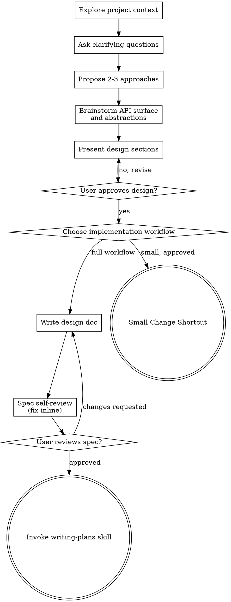

# Brainstorming Ideas Into Designs

Help turn ideas into fully formed designs and specs through natural collaborative dialogue.

Start by understanding the current project context, then ask questions one at a time to refine the idea. Once you understand what you're building, present the design and get user approval.

<HARD-GATE>
Do NOT invoke any implementation skill, write any code, scaffold any project, or take any implementation action until you have presented a design and the user has approved it. This applies to EVERY project regardless of perceived simplicity.
</HARD-GATE>

## Anti-Pattern: "This Is Too Simple To Need A Design"

Every project goes through this process. A todo list, a single-function utility, a config change — all of them. "Simple" projects are where unexamined assumptions cause the most wasted work. The design can be short (a few sentences for truly simple projects), but you MUST present it and get approval.

## Checklist

You MUST create a task for each of these items and complete them in order:

1. **Explore project context** — check files, docs, recent commits (only if instructed to by user), relevant skills, rules, dependencies and guidance. Find existing abstractions, helpers, utilities, interfaces, traits to be reused.
2. **Ask clarifying questions** — one at a time, understand purpose/constraints/success criteria. For questions where you have multiple answer proposals, use your system's "ask questions" tool
3. **Propose 2-3 approaches** — with trade-offs and your recommendation
4. **Brainstorm API surface and abstractions** — explore project context again to find any existing implementations of proposed additions; inventory current public and internal APIs, identify ad hoc branching and leaky boundaries, and propose interface changes that make the work generic instead of special-cased
5. **Present design** — in sections scaled to their complexity, get user approval after each section. Use your system's "ask questions" tool.
6. **Choose implementation workflow** — decide whether this needs the full documented workflow or qualifies for the Small Change Shortcut below
7. **Write design doc** — save to `docs/superpowers/specs/YYYY-MM-DD-<topic>-design.md` unless using the Small Change Shortcut
8. **Spec self-review** — quick inline check for placeholders, contradictions, ambiguity, scope (see below). Don't be afraid to go back to asking questions and approvals.
9. **Adversarial self-review** — if external coding agents are available as tools/MCP servers/skills, invoke them to review the spec. 
10. **User reviews written spec** — ask user to review the spec file before proceeding
11. **Transition to implementation** — invoke writing-plans skill to create implementation plan or proceed using your system's recommended workflow (confirm with user using "ask questions" tool)

## Process Flow

## Small Change Shortcut

After exploring context, presenting approaches, brainstorming the API surface, and getting design approval, estimate whether the cost of writing and reviewing spec and plan files would exceed the implementation cost.

Use the shortcut only when all are true:

- The approved design is small enough to state clearly in the conversation.
- The change is local, with obvious file scope and no new architecture.
- Verification is straightforward and can be named before implementation.
- Skipping spec and plan files will not make future context recovery materially harder.

When it qualifies, ask the user to choose one of these options instead of writing a spec:

1. **Inline execution** - implement directly in this session, then verify.
2. **Direct subagent dispatch** - dispatch one bounded subagent with the approved design, file scope, and verification command.
3. **Full workflow** - write the spec and continue to `writing-plans`.

The shortcut does not skip design approval, file-scope discipline, or verification. If uncertainty appears during implementation, stop and return to the full workflow or ask the user for direction.

## The Process

**Understanding the idea:**

- Check out the current project state first (files, docs, recent commits (only if the user requests it), relevant skills, rules, dependencies and guidance)
- Ask questions one at a time to refine the idea
- Prefer multiple choice questions when possible, but open-ended is fine too
- Only one question per message - if a topic needs more exploration, break it into multiple questions
- Prefer using your harness's tools to ask questions: this makes it easier for users to reply
- Focus on understanding: purpose, constraints, limitations, scope, backward compatibility requirements (or lack thereof), focus
- Determine how exhaustive testing should be: don't cargo-cult TDD, only use tests when invariants can't be checked using type system/compiler/linting

**Exploring approaches:**

- Propose 2-3 different approaches with trade-offs
- Before presenting the approaches, try to figure out which choices have obviously superior approaches and group them into a single confirmation question and present it as a yes/no question to save time. If the user replies "no", fall back to presenting approaches one-by-one. Just make sure that you present the different options too.
- Present options conversationally with your recommendation and reasoning, prefer using your harness's tools to ask questions:
- Lead with your recommended option and explain why

**Brainstorming the API surface:**

- See the `designing-with-types-and-abstractions` skill for general guidance
- Inventory the current public and internal APIs, data shapes, and call boundaries before deciding what should stay stable and what should change
- Look for manual branching, duplicated code paths, leaky internal APIs, and backend-specific conditionals that should become a shared abstraction instead of accumulating more branches
- Propose the interface, trait, type, and module boundary changes needed to make the current work scope generic and extensible
- For Rust, prefer traits, enums, exhaustive pattern matching, and static dispatch by default; use dynamic dispatch only at true runtime selection boundaries
- For TypeScript, prefer interfaces, discriminated unions, explicit capability types, and exhaustive pattern matching so the compiler can rule out invalid combinations
- Encode as many invariants as possible in the type system; avoid designs that depend on callers remembering hidden rules
- Think in interfaces first, then implementations
- Each unit should be self-contained: a method, type, or module should be understandable and verifiable without reading external invariants or unrelated code
- Core principle: you should be able to reason about each API unit independently. Any consumers of an API unit should not have to be aware of the API's implementation, only its interface. Any additional invariants not encoded in the type system must be documented. This way, parallel implementation subagents can start performing implementations without waiting for the dependent APIs to be implemented by other subagents.
- Keep files short, split existing long files to keep code readable

**Presenting the design:**

- Once you believe you understand what you're building, present the design
- Scale each section to its complexity: a few sentences if straightforward, up to 200-300 words if nuanced
- Ask after each section whether it looks right so far
- Cover: architecture, components, data flow, error handling, testing
- Cover implementation topology: independent units, shared interfaces, sequencing constraints, and verification gates the planner must preserve
- Cover tooling: which commands belong to implementation vs verification, and how verbose tools should produce concise/structured output
- Be ready to go back and clarify if something doesn't make sense

**Design for isolation and clarity:**

- Break the system into smaller units that each have one clear purpose, communicate through well-defined interfaces, and can be understood and tested independently
- For each unit, you should be able to answer: what does it do, how do you use it, and what does it depend on?
- Can someone understand what a unit does without reading its internals? Can you change the internals without breaking consumers? If not, the boundaries need work.
- Smaller, well-bounded units are also easier for you to work with - you reason better about code you can hold in context at once, and your edits are more reliable when files are focused. When a file grows large, that's often a signal that it's doing too much.

**Working in existing codebases:**

- Explore the current structure before proposing changes. Follow existing patterns.
- Where existing code has problems that affect the work (e.g., a file that's grown too large, unclear boundaries, tangled responsibilities), include targeted improvements as part of the design - the way a good developer improves code they're working in.
- Don't propose unrelated refactoring. Stay focused on what serves the current goal, but propose relevant improvements, e.g. by introducing abstractions instead of creating ad-hoc solutions/branches.

## After the Design

**Documentation:**

- For the full workflow, write the validated design (spec) to `docs/superpowers/specs/YYYY-MM-DD-<topic>-design.md`.
- For the Small Change Shortcut, keep the approved design and verification command in the conversation instead of writing a spec file.

**Spec Self-Review:**
After writing the spec document, look at it with fresh eyes:

1. **Placeholder scan:** Any "TBD", "TODO", incomplete sections, or vague requirements? Fix them.
2. **Internal consistency:** Do any sections contradict each other? Does the architecture match the feature descriptions?
3. **Ambiguity check:** Could any requirement be interpreted two different ways? If so, pick one and make it explicit.
4. **Context comprehensiveness** Does this spec contain all information necessary to continue in a new session?
5. **Implementation topology:** Does the spec identify independent implementation units, shared interfaces, sequencing constraints, and verification gates clearly enough for `writing-plans` to build a project network diagram?
6. **Tooling and output:** Does the spec identify contended verification commands and any concise/structured output requirements?

Fix any issues inline. No need to re-review — just fix and move on.

**Adversarial self-review** 
If available, invoke a 3rd party agent to review the spec using the "spec self-review" guidance.

**User Review Gate:**
After the spec review loop passes, ask the user to review the written spec before proceeding:

> "Spec written to `<path>`. Please review it and let me know if you want to make any changes before we start writing out the implementation plan."

Wait for the user's response. If they request changes, make them and re-run the spec review loop. Only proceed once the user approves.

**Implementation:**

- For the full workflow, invoke the writing-plans skill to create a detailed implementation plan. Do NOT invoke any other skill; writing-plans is the next step.
- For the Small Change Shortcut, use the approved inline or direct-subagent path and run the named verification before claiming completion.

## Key Principles

- **One question at a time** - Don't overwhelm with multiple questions
- **Multiple choice preferred** - Easier to answer than open-ended when possible
- **YAGNI ruthlessly** - Remove unnecessary features from all designs, but without omitting requested items silently
- **Explore alternatives** - Always propose 2-3 approaches before settling
- **Incremental validation** - Present design, get approval before moving on
- **Be flexible** - Go back and clarify when something doesn't make sense
