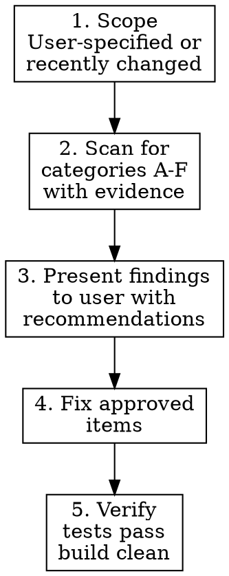

# Deslopify

## Overview

Code should say what it means and mean what it says. Slop is code that's redundant, misleading, unnecessarily complex, testing the obvious, or hiding assumptions.

**Core principle:** Remove what obscures meaning. Keep what provides it.

## When to Use

**Only on explicit user request.** Not automatic. When the user says:
- "deslopify this code"
- "review for quality"
- "clean up unnecessary code"
- "this code is sloppy, improve it"

**Not for:**
- Dead code removal → `jj-superpowers:codebase-cleanup`
- Which tests to write → `jj-superpowers:test-driven-development` and `what-to-test.md`
- Debugging failures → `jj-superpowers:systematic-debugging`

## Scoping

Ask the user what scope to review. Default suggestion: recently changed files. Offer whole-directory if they want thoroughness.

Never deslopify code you don't understand. Read before removing.

## The Deslopify Checklist

Five categories. Scan for each. Gather findings with evidence before presenting.

### A. Suspicious Logic

Conditions, control flow, or expressions that don't mean what they appear to.

- Conditions that are always true or always false
- Unreachable code paths not caught by linters
- Inverted or contradictory boolean logic
- Off-by-one errors not caught by linters
- Wrong operator precedence assumptions
- Security logic errors: auth bypass, privilege escalation, injection vectors (not things linters catch)

**Fix:** Correct the logic. Add an assertion or type encoding if the correct behavior should be structurally enforced.

### B. Undocumented Invariants

Assumptions that aren't encoded in types or documented — code that works but only if you "just know" something.

- Implicit assumptions not encoded in types
- Preconditions callers must satisfy but aren't documented
- State machines with unwritten transitions
- Functions where "you just have to know" the calling order
- **Silent assumption masking in branches**: Control flow that hides unmet assumptions instead of surfacing them. When `foo.bar` is `Optional<T>` but the code assumes it's always present, silently handling the `None` case masks a potential bug. Fail fast (return `Err`, panic, throw) when assumptions are violated. If a fallback is genuinely correct — which is rare — document *why* and make the decision explicit.
- **Silent fallbacks**: Code that silently defaults instead of surfacing a real choice or error
- **General fallbacks**: `orElse`, `unwrap_or`, catch-all branches that hide logic rather than making it explicit

**Fix:** Encode in types, add assertions, add doc comments, or fail fast on unmet assumptions.

### C. Tautological / Redundant Tests

(For detailed guidance → `jj-superpowers:test-driven-development` and `what-to-test.md`)

- Tests that mirror the implementation (assertion restates the code)
- Tests of type-system guarantees (compiler enforces these)
- Tests where the assertion can never fail by construction
- Tests whose meaning is obvious from reading the source

**Fix:** Remove the test, or replace it with a test of a real invariant.

### D. Overengineering

Abstractions and configurability added for hypothetical future use.

- Abstractions with one implementation
- Configurability for hypothetical future needs
- Generic interfaces for a single concrete use
- Premature optimization
- **Unnecessary branching**: `if`/`match` branches that always take one path, feature flags permanently on
- **Placeholders**: TODO stubs, `unimplemented!`, empty `catch` blocks that swallow errors
- **Legacy shims**: Compatibility adapters for APIs no longer needed
- **Compatibility wrappers where API compatibility wasn't requested**: Wrappers preserving an interface no consumer requires

**Fix:** YAGNI. Remove until the second use case exists or the consumer is real.

### E. Under-engineering / Duplication

Duplication and inconsistency that should be unified or at least made consistent.

- Duplicated logic reimplemented for a differently-named type — could be replaced with a newtype + delegation/traits/interfaces
- Duplicates of utility functions and types already implemented elsewhere — can they be made generic? Can traits/interfaces avoid duplication even if it adds modest complexity?
- Duplicated logic that could be extracted
- Unnecessary wrapper functions
- Comments that restate the code
- Unused parameters not caught by linters
- Code that could be made generic but isn't — same pattern across multiple types deserves a trait/interface rather than N copies
- **Inconsistent configuration schema**: Similar config structs with slightly differing field names, enum variants with identical semantics but different names, or unreasonable default values that silently produce incorrect behavior. Even when configs can't share a schema, enforce consistent field naming so users don't track many variants of semantically identical fields.
- **Unreasonable defaults**: Defaults that silently produce wrong behavior instead of failing fast
- **Cacheable work not cached**: Expensive computations, lookups, or transformations that are repeated without caching — without a reason to recompute each time
- **Unused caches**: Caches that exist but aren't consulted where they should be — the work is recomputed anyway, making the cache dead code

**The overengineering / under-engineering distinction:** Overengineering creates abstractions for hypothetical future uses. Under-engineering ignores duplication that already exists across the codebase. One is premature; the other is neglecting the second use case that has already arrived.

**Fix:** Extract shared abstractions when duplication exists. Use traits/interfaces/newtypes. Avoid N copies of the same logic for differently-named types. Cache expensive operations and reuse existing caches.

### F. Poor Organization

Files and modules structured in ways that obscure rather than reveal the codebase's shape.

- **Long files**: Files over ~500 lines usually mix multiple responsibilities. Split by responsibility, not by arbitrary line count. Files over ~1000 lines are presumptively unacceptable.
- **Flat modules**: Directories with many files at one level and no submodules. Organize code in a tree that mirrors the domain — group related types, functions, and tests together.
- **Tests mixed with implementation**: Long test suites in the same file as the code they test. Only tests that help readers understand invariants or intent belong near implementation. Exhaustive test suites go in dedicated test files or directories.

**Fix:** Split long files by responsibility. Organize flat modules into subdirectories that reflect the domain. Move comprehensive test suites to dedicated test files; keep only invariant/intent tests near the implementation.

## Process

**Step 1:** Ask user for scope. Suggest recently changed files.

**Step 2:** Scan for each category. For every finding, note the file, line, and evidence (why it's slop, not just "this looks wrong").

**Step 3:** Present all findings with recommendations. Let user approve what to fix. Don't remove or change code without approval.

**Step 4:** Fix approved items.

**Step 5:** Run tests and build. Verify nothing broke.

## Rationalization Table

| Excuse | Reality |
|--------|---------|
| "I might need this later" | Add it when you need it |
| "It's not hurting anything" | Slop accumulates and obscures meaning |
| "What if we want configurability?" | YAGNI — add it when the second case appears |
| "This test documents behavior" | Tests that restate implementation don't document — they echo |
| "Deleting tests feels wrong" | Tests that test nothing consume CI time and attention |
| "The existing code works" | Working code with hidden assumptions is a time bomb |
| "We'll clean it up later" | Later never comes. Clean it now or accept the slop |
| "This fallback handles the edge case" | Does it? Or does it hide a bug? Fail fast |
| "It's just a long file" | Long files mix responsibilities and obscure meaning |
| "Flat is simpler" | Flat directories with 20+ files aren't simple, they're chaotic |

## Common Mistakes

- **Don't remove tests without checking they're truly redundant** — not just poorly named
- **Don't refactor code that's about to be replaced** — ask the user first
- **Don't break public API without checking backwards compatibility**
- **Don't treat linter-detectable issues as slop** — use the linter, that's what it's for
- **Don't deslopify code you don't understand** — read before removing
- **Don't split files by arbitrary line count** — split by responsibility
- **Don't cache prematurely** — but don't skip caching just because something seems cheap. Repeated operations add up (e.g., text shaping per frame). When an API provides a caching mechanism, there's usually a reason. Implementing performance correctly up front is often better than guessing why things are slow later.

## The Bottom Line

**Remove what obscures meaning. Keep what provides it.**

Slop is any code that makes the codebase harder to understand without adding corresponding value. A test that echoes the implementation, a branch that silently handles what should be an error, an abstraction for one use case — these all obscure meaning.