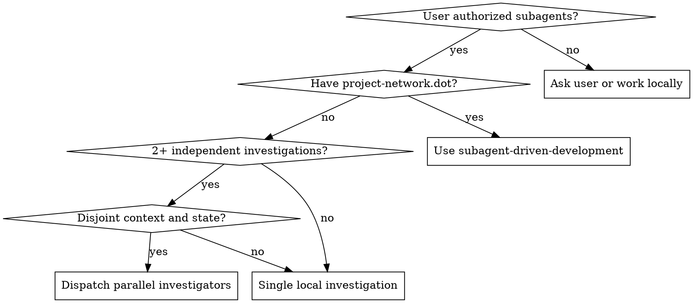

# Dispatching Parallel Agents

## Overview

Use this for ad hoc parallel investigations, not planned implementation. When several failures, files, or subsystems can be understood independently, dispatching one focused agent per domain can find root causes faster while preserving the orchestrator's context.

If there is a written implementation plan with `project-network.dot`, use `subagent-driven-development` instead. If the user has not authorized subagents in this conversation or platform policy requires explicit permission, ask or proceed locally.

**Core principle:** parallelize independent investigation, then integrate findings deliberately.

## When to Use



Use for:

- Multiple unrelated test failures in different files or subsystems.
- Independent code archaeology questions where each agent can inspect a separate area.
- Map/reduce style exploration before a design or cleanup decision.
- Independent root-cause hypotheses that can be checked without editing shared files.

Do not use for:

- Planned implementation work; use `subagent-driven-development` with `project-network.dot`.
- Related failures where one root cause may explain the others.
- Tasks that require shared mutable state, the same file scope, or the same contended command.
- Exploratory work where you cannot yet define separate domains.

## Pattern

1. Identify domains by file, subsystem, failing test group, or hypothesis.
2. Confirm domains are independent and do not need shared writes or shared runtime state.
3. Dispatch one investigator per domain with a focused, self-contained prompt.
4. Continue useful local work while agents run.
5. Review each result, compare for contradictions, then run the relevant integrated verification before claiming anything.

Investigation agents should usually report findings, evidence, and recommended fixes. Only let them edit files when the user has asked for edits and each agent has a disjoint write scope.

## Prompt Structure

Each prompt needs:

- **Scope:** exact file, directory, test group, subsystem, or hypothesis.
- **Goal:** what question to answer or symptom to explain.
- **Constraints:** files they may read or edit, commands they may run, and what not to change.
- **Evidence:** error output, test names, stack traces, or search terms.
- **Output:** root cause, evidence, recommended fix, files changed if any, and verification run.

Example:

```markdown
Investigate failures in `src/agents/agent-tool-abort.test.ts` only.

Goal: identify whether the three abort-related failures come from test timing or production abort behavior.

Constraints:
- Do not edit files.
- Do not investigate batch completion or tool approval tests.
- Do not run the full suite; run only this test file if needed.

Evidence:
- "should abort tool with partial output capture" expects "interrupted at".
- "should handle mixed completed and aborted tools" aborts the fast tool.
- "should properly track pendingToolCount" expects 3 results but gets 0.

Return:
- Root cause with file:line evidence.
- Whether a production fix or test fix is needed.
- Commands run and results.
```

## Integration

When agents return:

- Read every report before acting.
- Check whether findings conflict or reveal a shared root cause.
- Inspect diffs yourself if agents edited files.
- Run one integrated verification command after combining results.
- If work expands into planned implementation, stop and use `brainstorming` or `writing-plans` as appropriate.

## Common Mistakes

- Dispatching without explicit subagent authorization in a platform that requires it.
- Using this when `subagent-driven-development` already applies.
- Giving every agent the whole problem instead of one domain.
- Letting agents edit overlapping files.
- Trusting summaries without checking evidence or diffs.
- Running contended commands in multiple agents when one batched verification would do.
