# Living Documentation

## Overview

Documentation expresses what code and types cannot. If the code or type system already says it, don't say it again.

**Core principle:** No documentation is better than wrong documentation.

## When to Use

- Writing or updating any code documentation
- Encountering redundant, stale, or code-duplicating docs
- Struggling to understand code that a short doc could explain
- Deciding whether and how to document something
- Creating or maintaining `DOCS.md`, runbooks, ADRs, module docs

**Not for:**
- What the type system enforces → encode in types (`jj-superpowers:designing-with-types-and-abstractions`)
- Code cleanup without doc implications → `jj-superpowers:deslopify`

## The Iron Law

```
No documentation is better than wrong documentation.
Wrong documentation is worse than no documentation.
Documentation that duplicates code is wrong documentation.
```

Redundant, contradictory, or unverifiable documentation MUST be deleted or fixed immediately.

**No exceptions:**
- Don't keep outdated docs "for reference"
- Don't add docs that restate what code clearly expresses
- Don't leave TODO docs — either write the doc or don't create the file
- Don't document what the type system already enforces

**Violating the letter of the rules is violating the spirit of the rules.**

## What Belongs in Docs

| Information type | Where it belongs |
|---|---|
| What the code does | Code itself (names, types, structure) |
| Why a decision was made | Doc comment or ADR |
| Invariants not expressible in types | Doc comment near the invariant |
| How to use the module/API | Module-level doc comment |
| System architecture / data flow | Mermaid diagram in module doc |
| How to run/debug/deploy | Runbook |
| Acknowledged limitations/drawbacks | Doc comment |
| Temporal ordering constraints | Doc comment |
| Cross-cutting architectural decisions | ADR |

**Cross-reference:** Express invariants via types first (`jj-superpowers:designing-with-types-and-abstractions`). Only document what types can't capture.

## Choosing Doc Form

```dot
digraph doc_form {
    rankdir=LR;
    info [label="Information needs\ndocumenting?" shape=diamond];
    types [label="Can it be expressed\nin types?" shape=diamond];
    encode [label="Encode in types.\nNo doc needed." shape=box style=filled fillcolor="#ccffcc"];
    local [label="Local to one\nfunction/module?" shape=diamond];
    inline [label="Inline doc comment" shape=box];
    xcut [label="Cross-cutting\narchitectural decision?" shape=diamond];
    adr [label="ADR" shape=box];
    ops [label="About running,\ndebugging, deploying?" shape=diamond];
    runbook [label="Runbook" shape=box];
    sys [label="System-level\noverview?" shape=diamond];
    mermaid [label="Module doc with\nMermaid diagram" shape=box];
    nodoc [label="Don't document it" shape=box style=filled fillcolor="#ffcccc"];

    info -> types;
    types -> encode [label="yes"];
    types -> local [label="no"];
    local -> inline [label="yes"];
    local -> xcut [label="no"];
    xcut -> adr [label="yes"];
    xcut -> ops [label="no"];
    ops -> runbook [label="yes"];
    ops -> sys [label="no"];
    sys -> mermaid [label="yes"];
    sys -> nodoc [label="no"];
}
```



## Doc Constitution: `DOCS.md`

Project-specific documentation conventions live in `DOCS.md` at the project root. In monorepos, each package can have its own `DOCS.md` that extends/overrides the root.

`DOCS.md` specifies:
- Where docs live (directory structure)
- What doc forms are used (ADR format, module READMEs, etc.)
- Naming conventions
- Diagram format preference (Mermaid for human-facing, Graphviz for specs)
- RFC2119 usage (MUST/SHOULD/MAY)
- Monorepo hierarchy (root defaults, package overrides)

**When starting work, check `DOCS.md` first.** If absent, follow this skill's defaults.

## Bidirectional Referencing

Code and docs MUST reference each other:
- **Doc comments** → link to architecture docs: `// See DOCS.md#auth-flow for the full picture`
- **Architecture docs** → link to code: `Implemented in src/auth/session.ts`
- **ADRs** → link to both implementing code and discussing docs
- **Module doc comments** → reference the module file path they describe

Unreferenced docs are stale docs. If you can't find the code a doc references, the doc is suspect.

## Maintenance

When maintaining docs alongside code changes:
1. **Small safe desloppifications** (removing comment-duplication, adding type-encoded invariants, fixing stale cross-references) → do inline
2. **Changes that could affect functionality** → offer separately. "I noticed X while documenting Y. Want me to fix that in a separate change?"
3. **Stale docs** → delete or update. Never leave stale docs.
4. **Overlapping docs** → merge into single source of truth. Remove the duplicate.

## When You Struggle

Two paths when you spent significant effort reading multiple files or tracing execution to understand something a short doc could have explained:

1. **Propose it** — Create a proposal in `docs/superpowers/docwishlist/` following the doc-wishlist format, then write the doc following this skill's rules.
2. **Write it directly** — Write the doc immediately following this skill's rules. No proposal needed.

Choose based on confidence. Understand the domain well enough? Write directly. Unsure about scope or content? Propose first.

## Diagrams

- **Human-facing docs** (README, architecture docs, runbooks) → Mermaid
- **Specs, plans, skill files** → Graphviz/DOT (existing project convention)

Use diagrams only when they add clarity beyond what a list or table provides.

## Rationalization Table

| Excuse | Reality |
|---|---|
| "Someone might need this later" | Add it when they need it. YAGNI applies to docs. |
| "It's not hurting anyone" | Stale docs mislead. Wrong assumptions waste time. |
| "More documentation is better" | Wrong docs are worse than no docs. |
| "I'll update it later" | Later never comes. Update now or delete. |
| "This comment explains what the code does" | Code explains what. Comments explain why. |
| "It's just a template" | Templates without content are noise. Fill it or don't create it. |
| "The old docs aren't wrong, just incomplete" | Incomplete docs are stale docs. Complete or delete. |
| "I don't want to delete someone else's work" | Outdated docs waste everyone's time including the author. |
| "This doc adds context" | Context that duplicates code isn't adding — it's contradicting. |

## Red Flags — STOP

- Writing a comment that restates the code
- Creating a doc file that duplicates an existing one
- Leaving a TODO in documentation
- Adding architecture docs without linking to code
- Documenting what the type system already enforces
- Creating overlapping docs for the same topic
- Updating code without updating affected docs
- Keeping a doc "for reference" when it's outdated

**All of these mean: Delete, merge, or fix. Don't leave them.**

## Common Mistakes

- **Don't write docs that restate code** — Comments explain why, not what
- **Don't create multiple docs for the same topic** — One source of truth
- **Don't leave stale docs** — Delete or update
- **Don't skip checking for existing docs** — Search before creating
- **Don't add docs without linking to code** — Unreferenced docs drift and die
- **Don't document what types enforce** — Use types instead (`jj-superpowers:designing-with-types-and-abstractions`)
- **Don't use diagrams when a list suffices** — Diagrams only when structure is genuinely complex
- **Don't use RFC2119 casually** — MUST means mandatory, SHOULD means recommended, MAY means optional