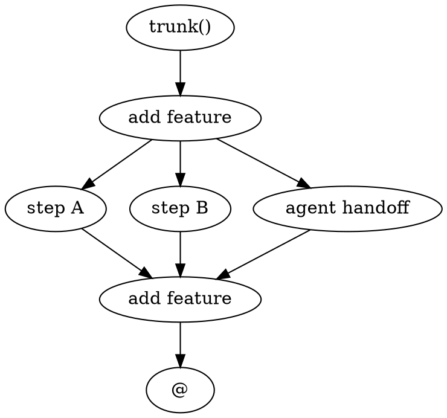

# DOT to jj DAG Builder

Convert a DOT digraph specification to a jj change DAG.

## Overview

`dot-to-jj-dag.py` is a utility for creating jj (Jujutsu) change DAGs from DOT graph specifications. It parses a DOT file describing a desired DAG structure, creates the actual jj changes, and outputs the result with assigned jj change IDs.

**Use case:** Subagents and automated workflows can programmatically create complex jj DAGs by specifying the structure in DOT format.

## Usage

### Basic Usage

```bash
# Using uv (recommended) — installs dependencies automatically
uv run dot-to-jj-dag.py <dot_file> --anchor-map <anchor_map_file>

# Or with Python directly (requires manual dependency installation)
python3 dot-to-jj-dag.py <dot_file> --anchor-map <anchor_map_file>
```

**Why use `uv run`?**
- Automatically installs dependencies from the script's PEP 723 metadata
- No need for separate `pyproject.toml` or `requirements.txt`
- Fast, portable, reproducible
- See [PEP 723: Inline Script Metadata](https://peps.python.org/pep-0723/)

### Arguments

- `<dot_file>` — Path to DOT file describing the DAG
- `--anchor-map <file>` — Path to anchor map file (optional)
- `--dry-run` — Print commands without executing them

### Example DOT File



### Example Anchor Map File

```
trunk = trunk()
@parent = @-
```

## How It Works

The script uses **PEP 723 inline script dependencies**. This means:
- Dependencies are declared in the script itself (no separate files needed)
- Run with `uv run --script` to automatically install and execute
- No need for `pyproject.toml` or `requirements.txt`
- Portable — script works anywhere `uv` is installed

**Dependencies:**
- `networkx[pydot]` — Graph library with pydot extra for DOT file support

The `[pydot]` extra syntax tells networkx to also install pydot, which provides pure Python DOT parsing (no C dependencies like pygraphviz).

See the `uv-guide` skill for more about PEP 723 and `uv run --script`.

## Node Types

| Type | Prefix | Purpose |
|------|--------|---------|
| `plan` | `plan: ` | Plan document — bottommost change, rooted at anchor |
| `todo` | `todo: ` | Sub-route: planned but not started |
| `scope` | `scope: ` | Scope merge: consolidates all sub-routes and temp changes |
| `temp` | `temp: ` | Temporary files: handoff/scratch files |
| `anchor` | (none) | Pre-existing revision (trunk, @-, etc.) — must be in anchor map |
| `at` | (none) | Working tree tip (@) — skip creation |

## Output

The script outputs:
1. Progress messages as changes are created
2. Verification output from `jj log trunk()..@`
3. Annotated DOT with `jj_id` fields added to all nodes

Example output (annotated DOT):
```dot
digraph {
  trunk  [type=anchor label="trunk()"   jj_id="trunk()"]
  plan0  [type=plan   label="feature"   jj_id="abcd1234"]
  step_a [type=todo   label="step A"    jj_id="efgh5678"]
  ...
}
```

## Architecture

### Workflow

1. **Parse DOT file** — Extract node metadata (type, label, existing jj_id)
2. **Load anchor map** — Map anchor node IDs to actual jj revsets
3. **Topological sort** — Process nodes in creation order (plans → scopes → todos/temps)
4. **Create changes** — Run `jj new` for each node, capture jj_id
5. **Verify** — Run `jj log trunk()..@` to confirm structure
6. **Output** — Print annotated DOT with all jj_id fields

### Node Creation Order

Nodes are created in this order to ensure proper parent/child relationships:

1. **Plan nodes** — topological order from anchors
2. **Scope nodes** — topological order
3. **Todo/temp nodes** — topological order (parents before children)

Anchor and 'at' nodes are skipped (they already exist).

### Safe Operations

- Always uses `--no-edit` with `jj new` (changes created below @, not at @)
- Always uses `--insert-after` and `--insert-before` (explicit placement)
- Captures change IDs immediately after creation
- Verifies final DAG structure

## Troubleshooting

### "Parse error" or "unknown node type"

Check DOT file syntax and node type values. Valid types: `plan`, `todo`, `scope`, `temp`, `anchor`, `at`.

### Changes not created as expected

Run with `--dry-run` to see what commands would be executed:
```bash
uv run dot-to-jj-dag.py example.dot --anchor-map anchors.txt --dry-run
```

## Integration with Skills

This script is used by the `jj-dag-builder` subagent prompt to create jj DAGs from DOT specifications in automated workflows.

The `jj-dag-builder` subagent can delegate DAG creation to this script rather than manually running `jj new` commands.

**See `uv-guide` skill** for comprehensive documentation on using `uv run`, including sandbox configuration when needed.

## Files

- **dot-to-jj-dag.py** — Main script with PEP 723 inline dependencies (works with `uv run`)
- **pyproject.toml** — Optional: project metadata for development/packaging
- **tests/test_dot_to_jj_dag.py** — Comprehensive pytest test suite with 30+ tests
- **tests/__init__.py** — Test package marker
