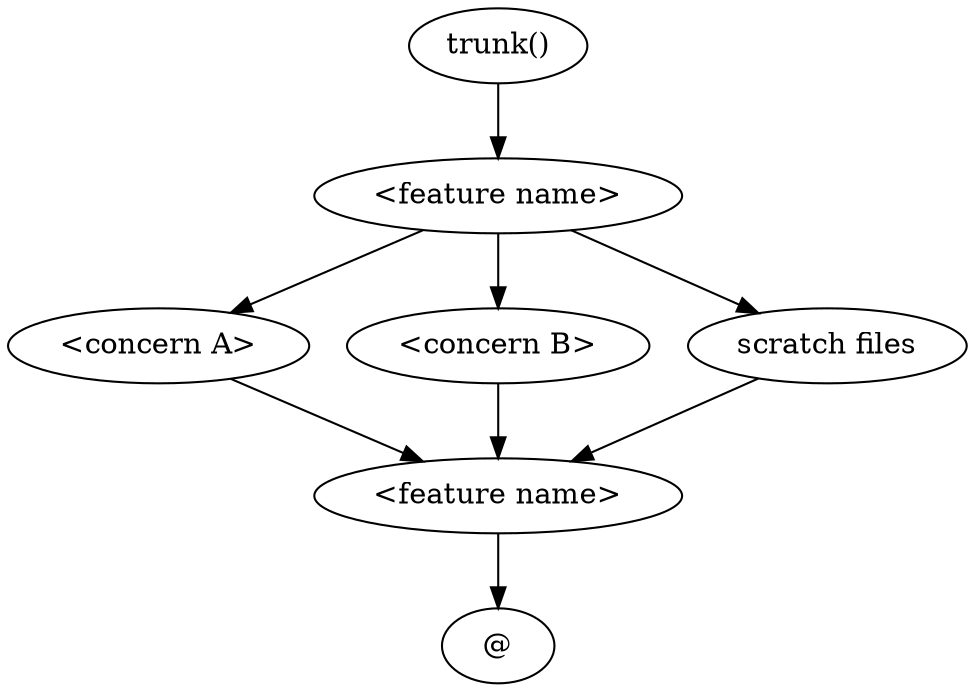
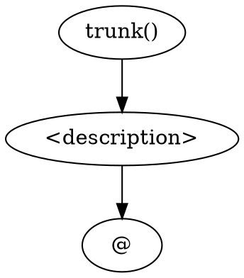

# jj Reorganize Changes

## Overview

Takes `toorg:` commits left by implementers and reorganizes them into a structured jj DAG (plan:/scope:/toreview: changes). Optional post-implementation step — use it when you want a clean, reviewable history before integration.

**Announce at start:** "I'm using the jj-reorg-changes skill to organize implementation commits."

## ⚠️ Safety Rules

Always use `--no-edit` with `jj new`. Never use `jj edit`, `jj next`, or `jj prev`.

Always pass `-m` — never open an editor.

Always use `--no-pager` on log/diff commands.

Always pass `-u` to `jj squash --from '@' --into '<id>'` — keeps `@` alive.

Use `change_id` (not `commit_id`) — stable through rebases.

## Phase 1: Analyze toorg: Commits

### Step 1: List toorg: commits

```bash
jj log -r 'trunk()..@' --no-pager \
  --template 'change_id.short(8) ++ "  " ++ description.first_line() ++ "\n"'
```

Identify all `toorg:` commits. These are the raw units of implementation work to reorganize.

### Step 2: Examine each commit

For each `toorg:` commit:
```bash
jj show -r <id> --stat --no-pager
```

Note which files each commit touches and what logical concern it represents.

### Step 3: Identify groupings and dependencies

Based on file sets and descriptions, identify:
- Which commits belong together as a single logical concern
- Which commits depend on others (ordering constraints)
- Which commits are truly independent (candidates for parallel sub-routes)

## Phase 2: Plan the DAG

### Step 1: Compose DOT graph

Express the proposed DAG as a DOT digraph:

| `type=`  | jj change prefix |
|----------|------------------|
| `plan`   | `plan: <label>`  |
| `todo`   | `todo: <label>`  |
| `scope`  | `scope: <label>` |
| `temp`   | `temp: <label>`  |
| `anchor` | (none — existing revset) |
| `at`     | (none — always `@`) |

Example for two independent concerns:


For sequential work: `plan0 -> step_a -> step_b -> scope0` (chain).

For a single concern: use `simple` — one `todo:` node, no scope merge needed:


### Step 2: Confirm DAG and base with user

Ask the user to confirm the base revision:

> "Where should the reorganized work be anchored?
> - `trunk()` (recommended)
> - `@-` (on top of current parent)
> - `<specific revision>`"

Then present the DOT graph:

> "Proposed DAG for your `toorg:` commits:
>
> ```dot
> <DOT GRAPH>
> ```
>
> Assignments:
> - `step_a` ← `toorg: <id1>`, `toorg: <id2>`
> - `step_b` ← `toorg: <id3>`
>
> Proceed, or adjust?"

Wait for explicit confirmation before proceeding.

## Phase 3: Build the DAG

### Step 1: Dispatch jj-dag-builder subagent

See `skills/subagent-driven-development/jj-dag-builder-prompt.md` for the full template.

Provide:
- The confirmed DOT graph
- The anchor map (e.g., `trunk = trunk()`)

Record the `jj_id` values from the annotated DOT the subagent returns.

### Step 2: Move toorg: content into DAG nodes

For each `todo:` node in the DAG, dispatch a jj-coordinator subagent to squash the assigned `toorg:` commits' files into it.

See `skills/subagent-driven-development/jj-coordinator-prompt.md` for the template.

For each node:
- **Target change ID**: the `jj_id` of the `todo:` node
- **Files to squash**: the union of all files from the `toorg:` commits assigned to this node
- **New description**: `toreview: <label>`

After each coordinator completes, verify the source `toorg:` commit is now empty:
```bash
jj diff -r <toorg_id> --no-pager
```
Expected: no output (all files moved out).

### Step 3: Abandon empty toorg: commits

```bash
jj abandon <toorg_id> [<toorg_id2> ...]
```

## Phase 4: Verify

```bash
jj log -r 'trunk()..@' --no-pager
```
Expected: no `toorg:` lines. All implementation nodes are `toreview:`.

**`@` must be empty:**
```bash
jj diff --no-pager --stat
```

**No divergent changes:**
```bash
jj log -r 'divergent() & (trunk()..@)' --no-pager
```

**No conflicted changes:**
```bash
jj log -r 'conflicts() & (trunk()..@)' --no-pager
```

If all pass: return to `finishing-a-development-branch` to continue.

## Phase 5: Adapt — Modify the DAG Mid-Flight

### Add a new parallel sub-route
```bash
jj new --no-edit -m "todo: <new step>" --insert-after '<plan-id>' --insert-before '<scope-id>'
```

### Add a sequential sub-route
```bash
jj new --no-edit -m "todo: <step>" --insert-after '<prior-id>' --insert-before '<scope-id>'
```

### Abandon a sub-route no longer needed
```bash
jj abandon '<change-id>'
```

## Integration

**Called optionally from:**
- **jj-superpowers:finishing-a-development-branch** — optional pre-integration step

**Uses:**
- `skills/subagent-driven-development/jj-dag-builder-prompt.md` — builds the DAG structure
- `skills/subagent-driven-development/jj-coordinator-prompt.md` — squashes toorg: content into nodes

**Overview:**
- **jj-superpowers:using-jj-worksets** — conceptual overview of this workflow
