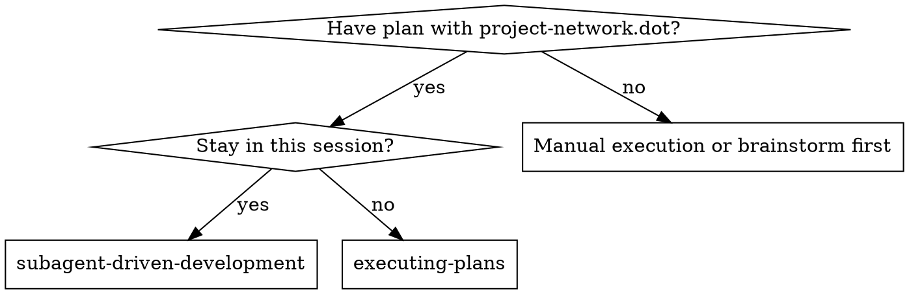
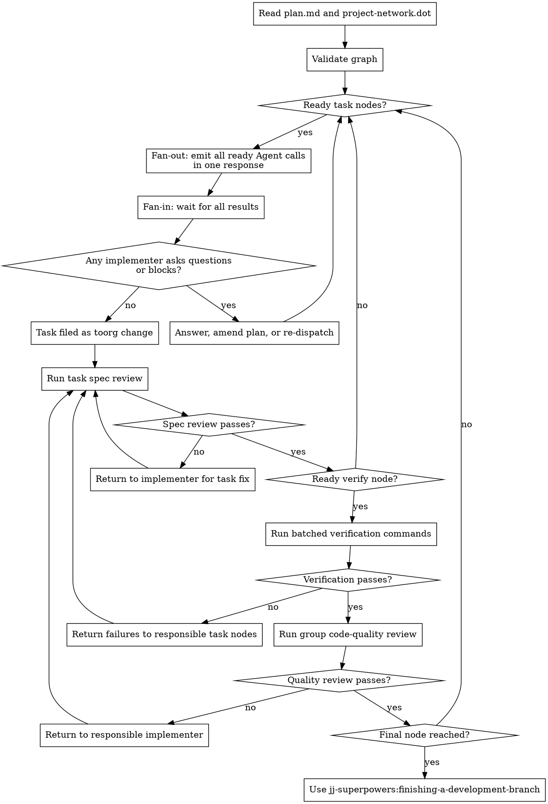

# Subagent-Driven Development

Execute `project-network.dot` from a written plan. Dispatch fresh implementer subagents for ready task nodes, run per-task spec review, batch contended verification commands at verify nodes, then run group-level code-quality review.

**Core principle:** task fan-out + per-task spec gates + verification fan-in + group quality review.

## When to Use



This skill is graph-first. A one-task plan is still executed through the same graph model.

## Graph Contract

Read `plan.md` and `project-network.dot`. Treat the graph as authoritative unless it is invalid or contradicts the task files.

Node kinds:

| Kind | Executor | Gate |
|------|----------|------|
| `task` | implementer subagent | files changed and filed |
| `spec_review` | spec reviewer subagent | task matches its task file |
| `verify` | verification subagent or orchestrator command runner | commands exit successfully |
| `quality_review` | code quality reviewer subagent | verified group is maintainable |
| `final` | orchestrator | all upstream gates passed |

Edges mean "source node must pass before target node may run."

## The Process



## Graph Validation

Before dispatching work, check:

- `plan.md` references `project-network.dot`.
- Every task node has `kind="task"`, `file`, and `files`.
- Every task node reaches exactly one downstream `spec_review`.
- Every `spec_review` reaches a `verify` node before any `quality_review`.
- Every `quality_review` depends on a successful `verify` node.
- Every terminal path reaches `final`.
- No cycles.
- No ready-to-run parallel task nodes have overlapping file scopes.

If the graph is invalid, fix the plan if the correction is mechanical and obvious. Otherwise ask the user before execution.

## Dispatch Rules

Prefer named role agents when the platform supports them. Pass only dynamic invocation context in the task message: graph node id, task or verification file path, relevant context paths, allowed file list, upstream reports, verification report, and orchestrator notes. Keep durable role behavior in the named agent's system/developer prompt.

**Parallel Dispatch Mechanics:** When multiple task nodes (or spec reviews) are ready and non-conflicting, dispatch them all by making multiple Agent tool calls in a **single response** — not one call per turn. Do not announce dispatch in a text turn and then make Agent calls in subsequent turns; that pattern produces sequential execution regardless of stated intent.

Default to **3–5 concurrent subagents** unless the user specifies otherwise. Maximize parallelism: keep all available slots filled at all times. When a subagent completes and a slot opens, immediately dispatch the next ready task — do not wait for other in-flight agents to finish first. Graph dependencies still govern sequencing: a `verify` node cannot start until all its upstream tasks have passed spec review, but there is no need to hold back dispatch just to form a tidy batch.

**Subagent freshness:** By default, fresh subagents should handle every node — clean context reduces noise. When routing spec review or code-quality failures back to an implementer, dispatch a new subagent with the review report and relevant context rather than reusing the original session.

**Exception — complex tasks:** If a task file flags a node as complex, or if the implementer returns `DONE_WITH_CONCERNS`, retain the session identifier. Route spec review and code-quality failures back to the original session (`SendMessage` in Claude Code) rather than a fresh agent — the original implementer holds design decisions and implementation reasoning that a fresh agent would waste time reconstructing. Switch to a fresh agent anyway when: the original session has grown long or context-heavy; the fix requires a fundamentally different approach; or the session is no longer reachable.

| Graph role | Named agent | Fallback prompt template |
|------------|-------------|--------------------------|
| `task` | `sdd-implementer` | `./implementer-prompt.md` |
| `spec_review` | `sdd-spec-reviewer` | `./spec-reviewer-prompt.md` |
| `verify` | `sdd-verifier` | `./verification-prompt.md` |
| `quality_review` | `sdd-quality-reviewer` | `./code-quality-reviewer-prompt.md` |
| jj filing helper | `sdd-jj-coordinator` | `./jj-coordinator-prompt.md` |

Platform locations:

| Platform | Project/user agent files | Invocation |
|----------|--------------------------|------------|
| Claude Code | plugin `agents/*.md`, `.claude/agents/*.md`, or `~/.claude/agents/*.md` | `Task` with the named agent |
| Codex | `.codex/agents/*.toml` or `~/.codex/agents/*.toml` | `spawn_agent(agent_type="<name>", message=...)` when custom agents are available |
| OpenCode | plugin-registered agents, `.opencode/agents/*.md`, or `~/.config/opencode/agents/*.md` | `@<name>` or Task tool with the named subagent |

If named agents are unavailable, use the fallback prompt templates exactly as before by filling the dynamic placeholders into the subagent message.

**Task nodes:** Dispatch `sdd-implementer` or fallback `./implementer-prompt.md`. Pass the task file path, relevant context docs, allowed file list from the node's `files` attribute, and any dynamic annotations from upstream completed nodes.

**Spec review nodes:** Dispatch `sdd-spec-reviewer` or fallback `./spec-reviewer-prompt.md` after each task reports `DONE` or `DONE_WITH_CONCERNS`. Spec review is task-local and happens before verification fan-in.

**Verify nodes:** Run the commands from the referenced `verify-*.md` file after all upstream spec reviews pass. Use `sdd-verifier` or fallback `./verification-prompt.md` when logs may be long or when summarization is useful. Most build tools only support one build/test suite at a time, so verification nodes are batched reduction points.

Verification commands and reports should follow `jj-superpowers:tool-output-discipline`: prefer quiet, structured, scoped, or filtered output, and expand only when concise output is insufficient for diagnosis.

**Quality review nodes:** Dispatch `sdd-quality-reviewer` or fallback `./code-quality-reviewer-prompt.md` after the upstream verify node passes. The review scope is the verified task group, not necessarily a single task.

**Final nodes:** After every upstream quality review passes, use `jj-superpowers:finishing-a-development-branch`.

## Verification Ownership

Implementers may run narrow task-local checks only when the task file names them. Implementers do not own group compile, test, lint, type-check, build, or smoke-test verification.

`cargo check`, `cargo build`, and `cargo test` are normally verification-node commands even when package-scoped or test-filtered, because they contend on shared target-directory state. A task file may name one only when it documents why that command is safe and necessary for the task.

When implementers run an allowed task-local command, they should use `jj-superpowers:tool-output-discipline` and report concise results.

Spec reviewers inspect implementation against the task file. They do not run group verification commands.

Verification nodes own the authoritative command results for their upstream group.

Code-quality reviewers inspect the verified group and the verification report. They do not rerun the same commands unless code inspection gives a concrete reason to believe the report is stale, incomplete, or contradicted by the diff.

## Model Selection

Use the least powerful model that can handle each role:

- Mechanical implementation tasks with clear files and APIs: fast, cheap model.
- Integration tasks, ambiguous failures, or cross-file coordination: standard model.
- Graph repair, design judgment, and code-quality review: strongest available model.
- Verification summarization with long logs: cheap model if no debugging is needed; stronger model if failure diagnosis is required.

## Handling Implementer Status

Implementer subagents report one of four statuses.

**DONE:** Run the task's `spec_review` node.

**DONE_WITH_CONCERNS:** Read concerns. If they affect correctness or scope, address them before spec review. If they are observations, include them for reviewers and proceed. Retain this session's identifier — the task is now considered complex and review failures should be routed back to it (see Subagent Freshness in Dispatch Rules).

**NEEDS_CONTEXT:** Provide missing context and re-dispatch.

**BLOCKED:** Assess the blocker:

1. If it is a context problem, provide more context and re-dispatch.
2. If the task requires more reasoning, re-dispatch with a more capable model.
3. If the task is too large, split it and update `project-network.dot`.
4. If the plan is wrong, amend the plan if mechanical or ask the user.

Never force the same model to retry without changing instructions, context, or task shape.

## BLOCKED Handling

When an implementer reports `STATUS: BLOCKED`, read `SCOPE`.

### `SCOPE: related`

The blocker is a dependency inside this plan.

1. If another graph node produces the missing thing, add or correct the dependency edge and run the producer first.
2. If a new task is needed, add a task file, update `plan.md`, and update `project-network.dot`.
3. If the new work is non-trivial, ask the user before expanding scope.

### `SCOPE: unrelated`

The blocker is a pre-existing gap outside this work scope. Pause and surface options:

> "Implementer for [task] is blocked by a pre-existing issue: [DETAIL].
> Options:
> 1. Add a fix to this plan
> 2. Note it as a separate task for later
> 3. Provide guidance and unblock manually"

Act on the user's choice and update the plan if execution graph changes.

## Prompt Templates

- `./implementer-prompt.md` - task node implementer
- `./spec-reviewer-prompt.md` - per-task spec review node
- `./verification-prompt.md` - verify node command runner
- `./code-quality-reviewer-prompt.md` - group quality review node
- `./jj-coordinator-prompt.md` - low-level jj filing helper when needed

## Example Workflow

```text
You: I'm using Subagent-Driven Development to execute project-network.dot.

[Read plan.md and project-network.dot]
[Validate graph: task_01 and task_02 are ready and have disjoint files]
[Create todos from graph nodes]

[Fan-out: dispatch task_01 + task_02 implementers — both Agent calls in one response]

task_01 implementer: DONE, filed toorg change
task_02 implementer: DONE_WITH_CONCERNS, filed toorg change

[Read task_02 concern; include in spec_02 message]
[Fan-out: dispatch spec_01 + spec_02 reviews — both Agent calls in one response]

spec_01: pass
spec_02: pass

[verify_01 is now ready: run verify-01-api-ui.md commands once]
verify_01: pass

[Run quality_01 review for task_01 + task_02 group]
quality_01: important issue in task_02

[Return to task_02 implementer for fix]
[Run spec_02 again]
[Run verify_01 again]
[Run quality_01 again]
quality_01: approved

[final reached]
[Use jj-superpowers:finishing-a-development-branch]
```

## Red Flags

Never:

- Execute a graph with cycles, orphan nodes, or missing gates.
- Dispatch parallel task nodes with overlapping file scopes.
- Announce dispatch in one response turn and make Agent calls in separate subsequent turns — all Agent calls for a parallel batch must be in the same response.
- Skip per-task spec review before verification fan-in.
- Run code-quality review before verification passes.
- Treat implementer task-local checks as group verification.
- Let implementers run `cargo check`, `cargo build`, `cargo test`, or other contended group commands unless the task file documents a concrete exception.
- Dump verbose command output when quiet, structured, scoped, or filtered output would answer the question.
- Have implementers run jj commands other than `jj commit [FILES] -m 'toorg: [description]'`.
- Let an implementer silently modify out-of-scope files.
- Paste full task text into subagent prompts; pass paths and context.
- Ignore subagent questions or `BLOCKED` reports.
- Mark a graph node complete while its gate has unresolved issues.

## Reporting Gaps

**If you encounter a command invocation issue** that could have been prevented by information in a skill, invoke **jj-superpowers:wish-i-knew** to log it, but only if the relevant information is genuinely absent or unclear in existing skills.

**If you find yourself doing something tedious, error-prone, or repetitive** that a reusable tool or script could automate but doesn't exist yet, invoke **jj-superpowers:wish-i-had** to log it.

**If you read multiple files or traced execution across modules** to understand something that a short documentation file could have explained immediately, invoke **jj-superpowers:documentation** to create that document.

Log and continue; do not block execution on logging.

## Integration

Required workflow skills:

- `jj-superpowers:writing-plans` - creates the plan and `project-network.dot`.
- `jj-superpowers:requesting-code-review` - code review template for quality reviewers.
- `jj-superpowers:finishing-a-development-branch` - completes development after final graph node.

Subagents should use:

- `jj-superpowers:test-driven-development` when their task requires TDD.
- `jj-superpowers:tool-output-discipline` when running CLI tools with potentially noisy output.

Alternative workflow:

- `jj-superpowers:executing-plans` - use when execution should happen inline or in a separate session.

## Skill Validation

When editing this skill or `writing-plans`, validate behavior with `../writing-plans/project-network-validation-scenarios.md` before deployment.
