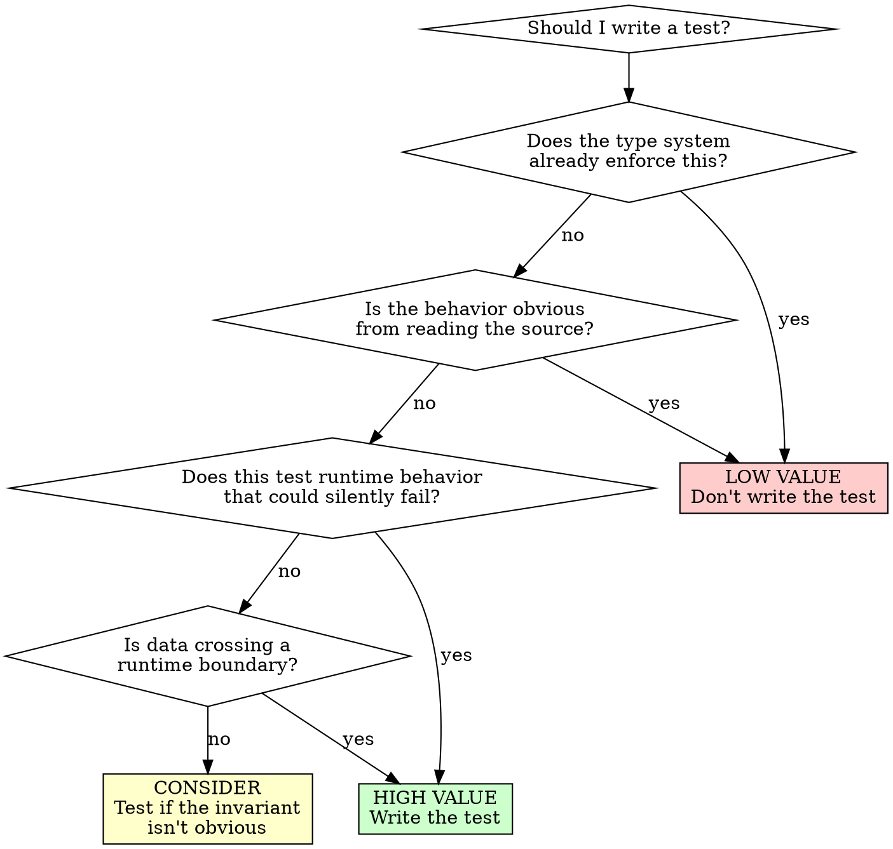

# What to Test

**Load this reference when:** deciding whether to write a test, questioning if a test provides value, or reviewing existing tests for redundancy.

## Overview

Not everything needs a test. Tests have value when they verify invariants that aren't obvious from reading the source code and that the type system can't enforce.

**Core principle:** If reading the source is enough to know it's correct, the test adds nothing.

## The Test Value Spectrum

### High-value tests

Tests that verify things **not obvious from reading the source** — things a reader (human or LLM) would have to reason carefully about, or things that could silently go wrong:

- **Safety of safe wrappers around `unsafe`**: If you have `unsafe` blocks wrapped in safe functions, the safety invariants are not enforced by the compiler. Tests are the only verification.
- **Concurrency/synchronization correctness**: Races, deadlocks, ordering guarantees — the compiler can't check these.
- **Well-definedness/consistency**: When the spec says "X must always produce the same result as Y" or "output must be sorted" — cross-cutting invariants that types don't enforce.
- **Adversarial tests**: Tests designed to simulate hard/tricky scenarios — fuzzing inputs, conflicting concurrent operations, resource exhaustion, boundary conditions that aren't immediately apparent.
- **Non-obvious edge cases**: Genuine boundary conditions and corner cases that aren't immediately apparent from reading the code. Not "what if this is None" on a type that's never None — actual edge cases where reasoning would fail without careful analysis.
- **Bug reproductions (while still relevant)**: Tests that reproduce real bugs, proving the fix works and preventing regression. After improving the API to structurally prevent the bug, consider whether the test still adds value — if the type system now prevents it, the test may be removable.

### Low-value tests

Tests that verify things **obvious from reading the source** or **already enforced by the compiler**:

- **Type-system mirrors**: Testing that required fields exist, return types match, or enum variants are exhaustive. The compiler enforces these.
- **Implementation echos**: Tests whose assertion restates the implementation logic. If the code says `x + 1`, the test asserts `result == input + 1` — you're not testing behavior, you're echoing code.
- **Tautological assertions**: `expect(true).toBe(true)` in disguise — assertions that can never fail because they check something the code guarantees by construction.
- **Obvious-from-reading tests**: Tests for logic so simple that any developer reading the source can immediately see correctness. A getter that returns a field doesn't need a test.

### The boundary: "obvious" is contextual

A test for `fn add(a: i32, b: i32) -> i32 { a + b }` is low-value — the behavior is obvious from reading.

A test for `fn calculate_discount(price: Decimal, tier: CustomerTier, region: Region) -> Decimal` after the same addition is high-value — the business rules, edge cases, and interactions aren't obvious from the source.

When in doubt, ask: **"Would a careful reader need this test to verify correctness, or could they verify it by reading the implementation?"**

## Decision Flowchart

## What Deserves Tests — Positive Examples

| Invariant | Why it needs a test |
|-----------|---------------------|
| `unsafe` block's safety proof | Compiler can't verify safety invariants |
| Concurrent map doesn't deadlock | Compiler can't prove synchronization |
| "parse then format is identity" | Cross-cutting consistency, not type-enforced |
| Discount calculation with edge cases | Business rules aren't obvious from code |
| API response shape matches runtime | Data crossing boundary, types erased |
| Bug reproduction (still relevant) | Proves fix, prevents regression |

## What Doesn't Deserve Tests — Negative Examples

| Assertion | Why it's low-value |
|-----------|-------------------|
| Function returns declared type | Compiler enforces |
| Required field exists on struct | Compiler enforces |
| Enum only accepts valid variants | Compiler enforces |
| `fn add(a, b) { a + b }` returns `a + b` | Obvious from reading |
| Getter returns the field it stores | Obvious from reading |
| `if let Some(x) = opt { x }` handles Some | Tautological |

## Cross-References

- **For removing existing redundant tests:** See `jj-superpowers:deslopify` skill
- **For test anti-patterns (mocking):** See `testing-anti-patterns.md`
- **For TDD process:** See SKILL.md in this directory

## The Bottom Line

**Write tests for invariants that aren't obvious and that the compiler can't check.**

If a careful reader could verify correctness from the source alone, the test adds nothing but maintenance burden.