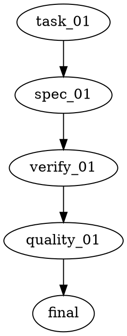
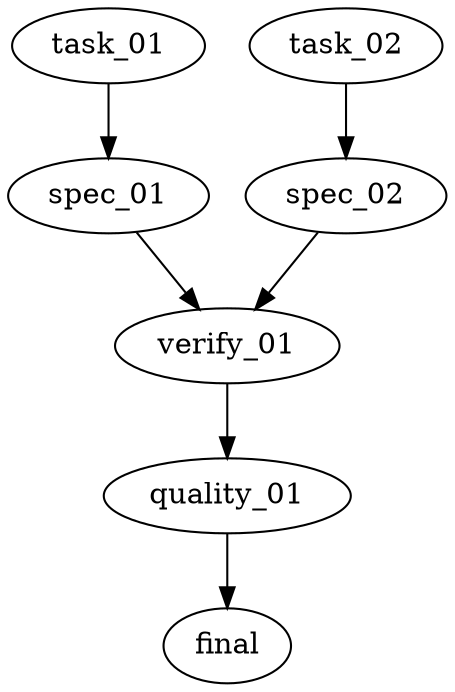

# Writing Plans

## Overview

Write comprehensive implementation plans assuming the engineer has zero context for our codebase and questionable taste. Document the exact files, APIs, invariants, commands, acceptance checks, and context needed to implement the work. DRY. YAGNI. TDD where it adds signal. Frequent verification.

Every plan is an execution graph. A small one-task change is just a small graph; do not create separate "simple", "chain", or "parallel" workflow modes.

**Announce at start:** "I'm using the writing-plans skill to create the implementation plan."

**Save plans to:** `docs/superpowers/plans/YYYY-MM-DD-<feature-name>/` (directory)
- User preferences for plan location override this default.

## Plan Directory

Create:

```text
docs/superpowers/plans/YYYY-MM-DD-feature-name/
  plan.md
  project-network.dot
  context/
    architecture.md
    tech-stack.md
  task-01-component-name.md
  verify-01-component-name.md
```

Create only context docs that multiple tasks would otherwise need to repeat.

## Project Network Diagram

`project-network.dot` is the execution contract. Edges mean "the source node must complete successfully before the target node may run." Parallelism is derived from graph readiness plus non-overlapping file scopes.

Allowed node kinds:

| Kind | Purpose | Required attributes |
|------|---------|---------------------|
| `task` | Implementer-owned work | `file`, `files` |
| `spec_review` | Per-task compliance gate | `task` |
| `verify` | Batched compile/test/lint/build gate | `file` |
| `quality_review` | Group-level code quality review after verification | `scope` |
| `final` | Final completion gate | none |

Rules:
- Every `task` node has exactly one downstream `spec_review`.
- A `verify` node may depend on one or more `spec_review` nodes.
- A `quality_review` node depends on a successful `verify` node.
- `final` depends on every terminal `quality_review`.
- Tasks may run in parallel only when their `files` attributes do not overlap.
- Commands that contend on shared build state, such as `cargo`, `bazel`, test suites, type checks, and linters, belong in `verify` nodes, not implementer tasks.
- **REQUIRED SUB-SKILL:** Use `jj-superpowers:tool-output-discipline` when writing verification commands.

One-task graph:



Parallel group:



## File Structure

Before defining tasks, map out which files will be created or modified and what each file is responsible for.

- Design units with clear boundaries and well-defined interfaces.
- Prefer focused files over large files that do too much.
- Treat roughly 500 lines as a warning threshold for touched files.
- Treat 1000 lines or more as generally unacceptable for touched files unless the language or framework forces it.
- Files that change together should live together. Split by responsibility, not by technical layer.
- In existing codebases, follow established patterns. If a file you're modifying is already unwieldy, include a focused split in the plan when it serves the task.

## Plan Document Header

`plan.md` is the lightweight index. It must contain only what the orchestrator needs to coordinate.

````markdown
# [Feature Name] Implementation Plan

> **Goal:** [One sentence describing what this builds]

**Project network:** `project-network.dot`

**Graph rationale:** [Why this graph shape preserves dependencies, groups verification, and avoids file contention.]

## Context Documents

- `context/architecture.md` - [one-line description]
- `context/tech-stack.md` - [one-line description]

## Tasks

1. `task-01-component-name.md` - [one-line summary]
2. `task-02-component-name.md` - [one-line summary]

## Verification

1. `verify-01-component-name.md` - [commands and expected success criteria]
````

No architecture prose, tech stack detail, or step detail in `plan.md`; those live in context, task, and verification files.

## Context Documents

Use short focused docs:

- `context/tech-stack.md` - languages, frameworks, key libraries and versions
- `context/architecture.md` - approach, key decisions, module boundaries
- `context/file-structure.md` - existing patterns to follow when non-obvious

No step-by-step implementation instructions in context docs.

## Task Files

Each task gets its own file at the plan root: `task-NN-component-name.md`.

````markdown
# Task N: [Component Name]

**Files:**
- Create: `exact/path/to/file.rs`
- Modify: `exact/path/to/existing.rs`

**Purpose:** [What this task changes and why.]

**Interfaces and invariants:**
- Define `MyTrait` in `exact/path/to/file.rs`:

  ```rust
  trait MyTrait {
      fn foo(&self) -> Result<Value, Error>;
  }
  ```

- Invariant: `foo` must not mutate persisted state on error.

**Subtasks:**
- [ ] Add the `MyTrait` definition and documentation.
- [ ] Update `MyStruct` to implement `MyTrait`.
- [ ] Add tests covering success and error behavior.

**Task-local checks:**
- Run only these narrow checks if useful: `[exact command]`
- Do not run `cargo check`, `cargo build`, `cargo test`, or other commands that contend on shared build state unless this task documents a concrete exception.
- Group compile/test/lint/build verification is handled by `verify-*` files.
````

Task files must be self-contained. Do not refer to sibling task files. If a task depends on a type or function produced by an upstream task, repeat the required interface in this task and make the dependency explicit in `project-network.dot`.

## Verification Files

Each `verify` node uses a file named `verify-NN-name.md`.

````markdown
# Verify N: [Group Name]

**Upstream tasks:** `task_01`, `task_02`

**Primary commands:**
- `cargo test -p crate_name -q`

**Failure diagnostics:**
- If the primary command fails with compile errors, run: `cargo check --message-format json-diagnostic-short -q | jq -crM 'select(.message.level == "error")'`

**Expected result:** Primary commands exit 0. No ignored failures. Diagnostic commands are for concise failure reporting and may not preserve the primary command's exit status. If a command fails because of a task-owned issue, return to that task's implementer and re-run its spec review before this verification node runs again.
````

Verification files own contended commands: compile, type check, build, lint, test suites, and smoke tests. Keep these commands batched at graph reduction points to avoid multiple agents waiting on shared build locks.

Write verification commands with tool-output discipline:

- Prefer quiet, structured, scoped, or filtered forms when they answer the verification question.
- Separate primary pass/fail commands from diagnostic commands when useful; filtered diagnostic pipelines must not be the only pass/fail signal unless they preserve the underlying tool's exit status.
- Put full-log commands behind an explicit escalation note rather than making them the default.
- Do not put contended commands such as `cargo check`, `cargo build`, or `cargo test` in task-local checks just because they can be package-scoped or test-filtered; they usually still block shared build state.

## No Placeholders

Every step must contain the actual information an engineer needs. These are plan failures:

- "TBD", "TODO", "implement later", "fill in details"
- "Add appropriate error handling" / "add validation" / "handle edge cases"
- "Write tests for the above" without describing the behavior to test
- "Similar to Task N"
- Steps that describe what to do without enough design guidance to act
- References to types, functions, or methods not defined in this task or an upstream graph dependency
- Legacy compatibility shims or backward compatibility re-exports unless the user explicitly asked for compatibility

You are writing a plan, not performing the implementation. Provide complete APIs, invariants, algorithms, helper choices, acceptance checks, and commands. Do not pre-write full implementation bodies unless that is the clearest way to remove ambiguity.

## Self-Review

After writing the complete plan, check it yourself:

1. **Spec coverage:** Every requirement maps to at least one task or verification node.
2. **Graph validity:** No orphan nodes, no cycles, every task reaches `spec_review -> verify -> quality_review -> final`.
3. **File contention:** No parallel-ready tasks touch overlapping files.
4. **Verification ownership:** Build/test/lint/type-check commands live in `verify-*` files, not implementer tasks.
5. **Output discipline:** Verbose tools use quiet, structured, scoped, or filtered output where practical.
6. **Type consistency:** Types, method signatures, and property names stay consistent across tasks.
7. **Placeholder scan:** No red flags from the "No Placeholders" section.

Fix issues inline. If a spec requirement has no task, add the task and update `project-network.dot`.

## Skill Validation

When editing this skill or `subagent-driven-development`, validate the behavior with `project-network-validation-scenarios.md` before deployment.

## Execution Handoff

After saving the plan, offer execution choice:

**"Plan complete and saved to `docs/superpowers/plans/<directory-name>/`. Two execution options:**

**1. Subagent-Driven (recommended)** - Execute `project-network.dot` with task fan-out, per-task spec review, verification fan-in, and group code-quality review.

**2. Inline Execution** - Execute the graph in this session using `executing-plans`, with checkpoints at verification and review nodes.

**Which approach?"**

If Subagent-Driven is chosen:
- **REQUIRED SUB-SKILL:** Use `jj-superpowers:subagent-driven-development`.

If Inline Execution is chosen:
- **REQUIRED SUB-SKILL:** Use `jj-superpowers:executing-plans`.
